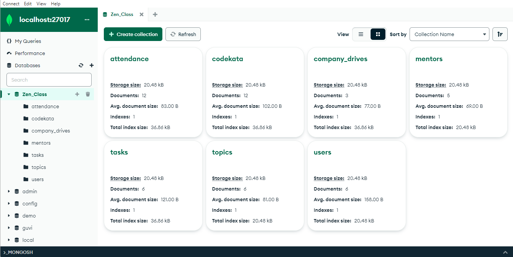

# MongoDB Task for Zen Class Programme

Designing a MongoDB database for the Zen class programme, covering users, codekata, attendance, topics, tasks, company drives, and mentors.

## Collections

1. **users** - User information
2. **codekata** - Problems solved by users
3. **attendance** - User attendance records
4. **topics** - Topics taught in the programme
5. **tasks** - Tasks assigned to users
6. **company_drives** - Company drives information
7. **mentors** - Mentor information

## Features

- Comprehensive database schema.
- Utilization of MongoDB’s aggregation framework for complex queries.

## Technologies Used

- MongoDB
- JavaScript

## Installation

1. Install MongoDB from the official [MongoDB website](https://www.mongodb.com/try/download/community).
2. Set up your MongoDB environment and start the server.
3. Use a MongoDB client or the MongoDB shell.

## Usage

1. Create the collections as described.
2. Insert sample data to test queries.

## Conclusion

This project showcases the versatility of MongoDB in handling diverse data needs for the Zen class programme.
